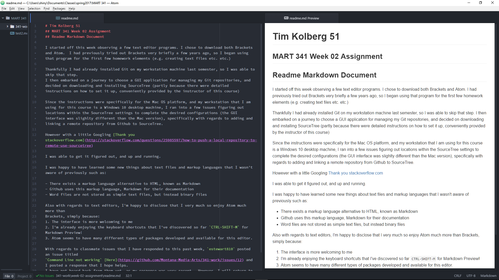

# Tim Kolberg 51
## MART 341 Week 02 Assignment
## Readme Markdown Document

I started off this week observing a few text editor programs. I chose to download both Brackets and Atom.  I had previously tried out Brackets very briefly a few years ago, so I began using that program for the first few homework elements (e.g. creating text files etc. etc.)

Thankfully I had already installed Git on my workstation machine last semester, so I was able to skip that step.
I then embarked on a journey to choose a GUI application for managing my Git repositories, and decided on downloading and installing SourceTree (partly because there were detailed instructions on how to set it up, conveniently provided by the instructor of this course)

Since the instructions were specifically for the Mac OS platform, and my workstation that I am using for this course is a Windows 10 desktop machine, I ran into a few issues figuring out locations within the SourceTree settings to complete the desired configurations (the GUI interface was slighlty different than the Mac version), specifically with regards to adding and linking a remote repository from Github to SourceTree.

However with a little Googling [Thank you stackoverflow.com](http://stackoverflow.com/questions/25985597/how-to-push-a-local-repository-to-remote-use-sourcetree)

I was able to get it figured out, and up and running.

I was happy to have learned some new things about text files and markup languages that I wasn't aware of previously such as:

- There exists a markup language alternative to HTML, known as Markdown
- Github uses this markup language, Markdown for their documentation
- Word files are not stored as simple text files, but instead binary files

Also with regards to text editors, I'm happy to disclose that I very much so enjoy Atom much more than
Brackets, simply because:
1. The interface is more welcoming to me
2. I'm already enjoying the keyboard shortcuts that I've discovered so far `CTRL-SHIFT-M` for Markdown Preview!
3. Atom seems to have many different types of packages developed and available for this editor.

With regards to classmate issues that I have responded to this past week, `estewart810` posted an issue titled
`Command Line not working` [Here](https://github.com/Montana-Media-Arts/341-work/issues/12) and I posted a response that I hope helps.
I have not heard back from them yet, as my response was very recent.  However, I will return to this post periodically to make sure that the
original poster finds resolution with their problem.

