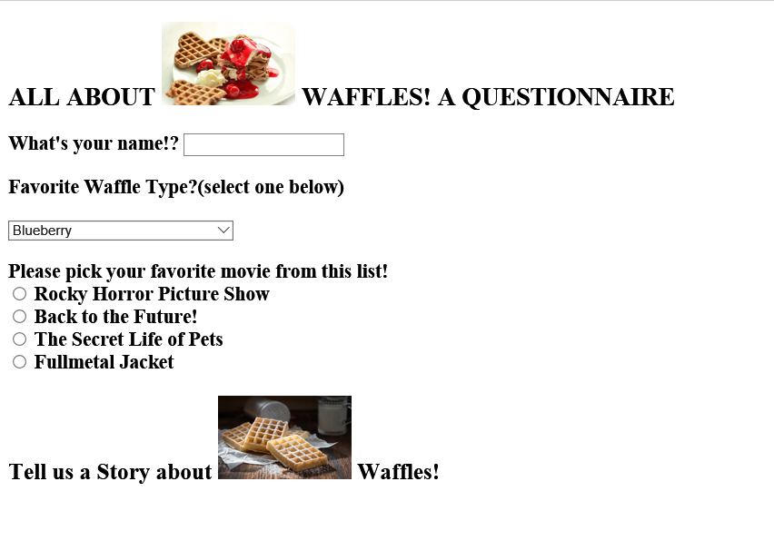
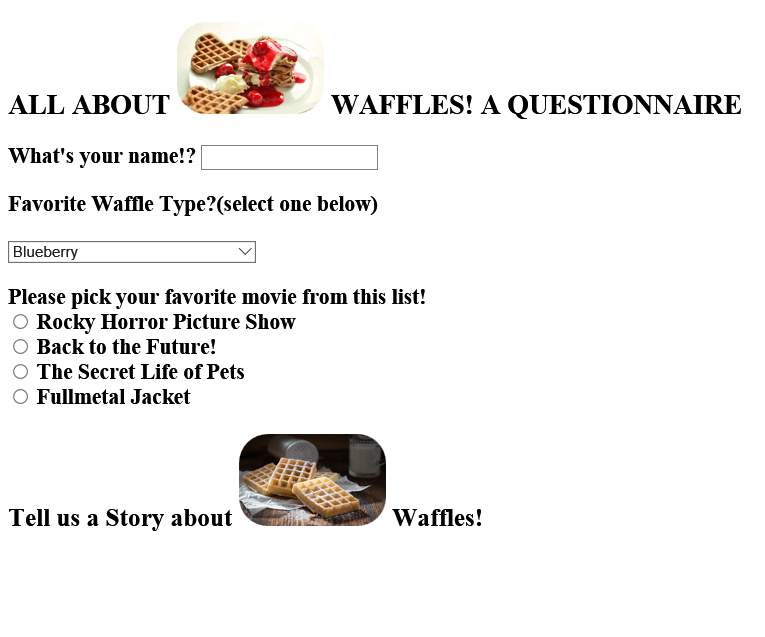
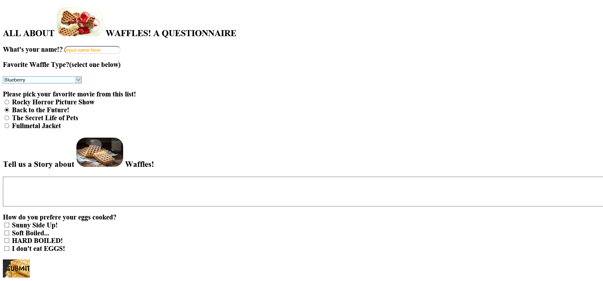

# Tim Kolberg 51
## MART 341 Week 05 Assignment
## Readme Markdown Document

### Week 5 Assignment
This week was all about forms and their element types found within.

### What I learned and Issues I Faced
Although I have worked within form tags before, and created a few basic ones, I had not studied them with as much detail
and in depth analysis as this weeks lesson plan presented.

### Form Page From Start to Finish
I began the form creation process with a header title, an image placed within that title in line,
and a few form input elements implemented at the start  
(dropdown menu, radio button selection list, title header for textarea element)
 

I then decided that I wanted to style the images in my form page a little.  So I implemented a simple border-radius css property to round off the corners
of the images.  

Finally I added the textarea tag, placeholder on the name text input element, and implemented a couple more form elements into the page, along with a submit button from a picture.
 

### Conclusion
It was fun learning about all of the different form elements available when creating online forms!  
I really enjoyed finding about about the textarea element, as its very cool that it has built-in spell checking functionality  
(creates red squigglies on inputted words that do not show up in the English dictionary)
